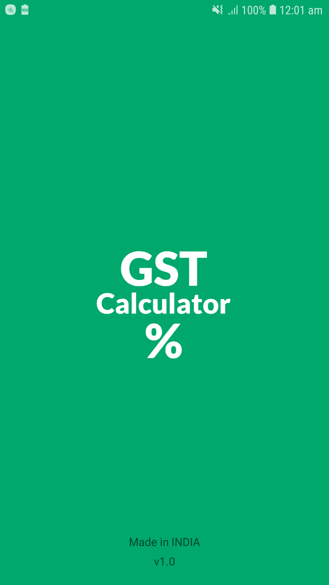
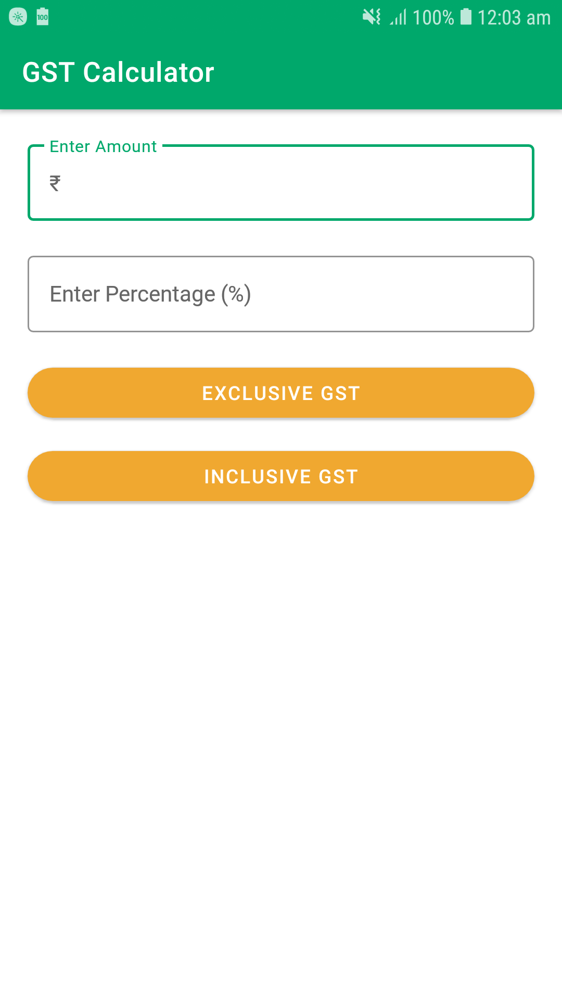
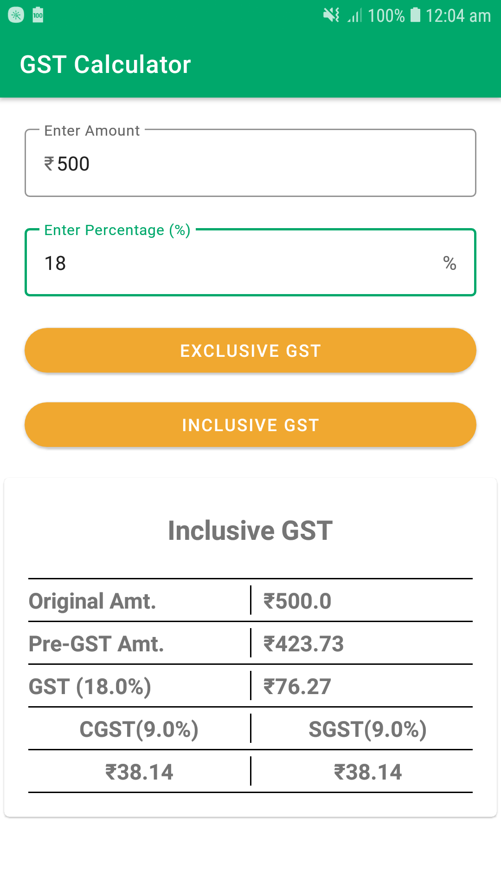

# GST Calculator

This is a simple single-screen Android application developed in 2020 that calculates the Goods and Services Tax (GST). The app was my first project in Android development and represents the starting point of my journey in mobile app development.

## Screenshots

<p align="center">
  
  
  
</p>
<!-- 

 -->

## Features

- Calculate GST for any given amount.
- Simple and intuitive user interface.

## Usage

- Enter the amount for which you want to calculate GST.
- Select the GST percentage rate.
- Click the 'Calculate' button to see the GST amount and the total amount including GST.

## Contributing

- Contributions, issues, and feature requests are welcome!

## Installation

To clone and run this application, you'll need [Git](https://git-scm.com) and [Android Studio](https://developer.android.com/studio) installed on your computer. From your command line:

```bash
# Clone this repository
$ git clone https://github.com/jayeshop/GST-Calculator.git

# Go into the repository
$ cd GST-Calculator

# Open the project in Android Studio and run it on your emulator or device
